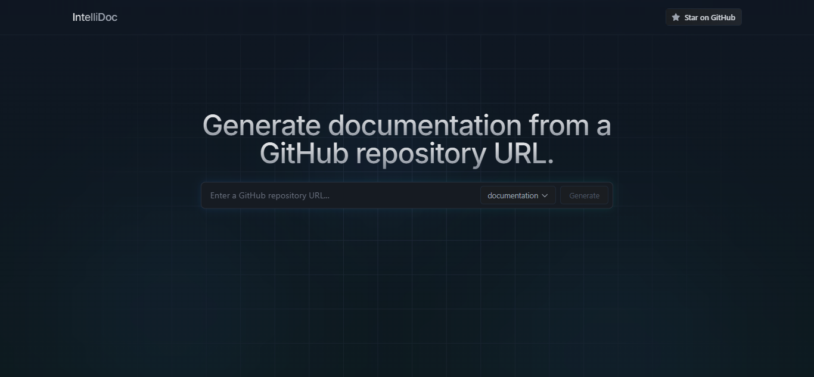

# IntelliDoc
IntelliDoc is an API designed to generate documentation from a GitHub repository URL. It leverages the Gemini language model and Langchain to analyze the codebase and produce structured outputs.


**Key Features:**
*   **Documentation Generation:** Automatically generates comprehensive documentation for a given GitHub repository.
*   **Dockerfile Generation:** Creates a Dockerfile tailored to the project's needs.
*   **Docker Compose Generation:** Generates a Docker Compose configuration for multi-container applications.
*   **API-Driven:** Provides a RESTful API for easy integration with other tools and services.
**Supported Platforms/Requirements:**
*   Python 3.7+
*   FastAPI
*   Langchain
*   Google Gemini API
*   Docker (for Dockerfile and Docker Compose generation)
*   Node.js and npm (for Repomix installation)
## Getting Started
### Prerequisites
Before you begin, ensure you have the following installed:
*   **Python:** Version 3.7 or higher.
*   **pip:** Python package installer.
*   **Docker:** For generating and using Dockerfiles and Docker Compose configurations.
*   **Node.js and npm:** Required for installing Repomix.
*   **Google Cloud Account:** Required to access the Gemini API.
*   **Git:** Required to clone the repository.
### Installation
1.  **Clone the repository:**
    ```bash
    git clone <repository_url>
    cd <repository_directory>
    ```
2.  **Create a virtual environment (recommended):**
    ```bash
    python3 -m venv venv
    source venv/bin/activate  # On Linux/macOS
    venv\Scripts\activate  # On Windows
    ```
3.  **Install the backend dependencies:**
    ```bash
    cd backend
    pip install -r requirements.txt
    ```
4.  **Set up environment variables:**
    *   Create a `.env` file in the `backend` directory.
    *   Add your Google API key:
                GOOGLE_API_KEY=<your_google_api_key>
        
5.  **Install Repomix:**
    ```bash
    npm install -g repomix
    ```
    This script checks if Repomix is installed and installs it globally using npm if it's not already present.
6.  **Install the frontend dependencies:**
    ```bash
    cd ../frontend
    npm install
    ```
### Running the Application
1.  **Start the backend server:**
    ```bash
    cd ../backend
    uvicorn main:app --host 0.0.0.0 --port 8000 --reload
    ```
    This command starts the FastAPI server on port 8000 with hot reloading enabled.
2.  **Start the frontend application:**
    ```bash
    cd ../frontend
    npm run dev
    ```
    This command starts the Vite development server, typically on port 5173.

## API Documentation
The backend provides the following API endpoints:
*   **`POST /generate-docs-from-url`:** Generates documentation from a GitHub repository URL.
    *   **Input:**
        ```json
        {
          "url": "https://github.com/username/repository"
        }
            *   **Output:** A string containing the generated documentation in Markdown format.
*   **`POST /generate-dockerfile`:** Generates a Dockerfile from a GitHub repository URL.
    *   **Input:**
        ```json
        {
          "url": "https://github.com/username/repository"
        }
            *   **Output:** A string containing the generated Dockerfile.
*   **`POST /generate-docker-compose`:** Generates a Docker Compose configuration from a GitHub repository URL.
    *   **Input:**
        ```json
        {
          "url": "https://github.com/username/repository"
        }
            *   **Output:** A string containing the generated Docker Compose configuration in YAML format.
*   **`GET /ping`:** A lightweight route to keep the server alive.
    *   **Output:**
        ```json
        {
          "message": "Pong!"
        }
        
